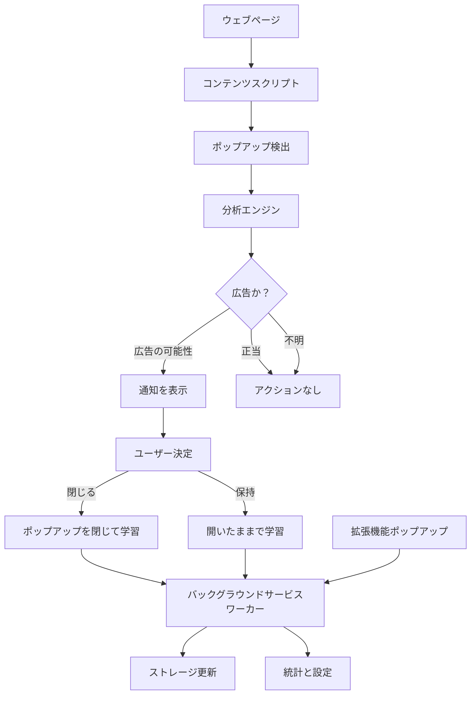

# 設計文書 - Chrome ポップアップ広告ブロッカー拡張機能

## 概要

このChrome拡張機能は、インテリジェントなポップアップ広告検出とユーザー制御によるブロック機能を提供します。拡張機能は、積極的な自動ブロックではなく提案ベースのアプローチを使用し、正当なウェブサイト機能を損なうことなく、ユーザーが侵入的な広告を管理できるようにします。

拡張機能は、DOM変更を監視するコンテンツスクリプト、拡張機能の状態を管理するバックグラウンドサービスワーカー、ユーザーインタラクションと設定管理のためのポップアップインターフェースを通じて動作します。

## 技術スタック

### プログラミング言語
- **TypeScript**: 型安全性とコード品質向上のためのメイン開発言語
- **JavaScript**: Chrome拡張機能APIとの互換性のため
- **HTML5**: ユーザーインターフェース構造
- **CSS3**: スタイリングとレスポンシブデザイン

### フレームワークとライブラリ
- **Chrome Extension Manifest V3**: 最新のChrome拡張機能アーキテクチャ
- **Chrome Extension APIs**: 
  - `chrome.storage` - データ永続化
  - `chrome.tabs` - タブ管理
  - `chrome.runtime` - メッセージパッシング
  - `chrome.notifications` - ユーザー通知
- **MutationObserver API**: DOM変更の効率的な監視
- **Web Components**: 再利用可能なUI要素（必要に応じて）

### 開発ツール
- **TypeScript Compiler**: 型チェックとJavaScriptトランスパイル
- **Jest**: ユニットテストフレームワーク
- **Chrome DevTools**: デバッグとパフォーマンス分析
- **ESLint**: コード品質とスタイル統一

## 開発・実行環境要件

### 必須環境
- **Node.js**: バージョン 16.0.0 以上（推奨: 18.x LTS）
- **npm**: バージョン 8.0.0 以上（Node.jsに付属）
- **Google Chrome**: バージョン 88 以上（Manifest V3サポート）
- **TypeScript**: バージョン 4.5.0 以上
- **Git**: バージョン管理用

### 開発環境セットアップ
```bash
# Node.jsとnpmのバージョン確認
node --version  # v18.x.x
npm --version   # 8.x.x

# プロジェクトの依存関係インストール
npm install

# TypeScriptのグローバルインストール（オプション）
npm install -g typescript

# 開発用ビルド（ウォッチモード）
npm run build:watch

# テスト実行
npm test
```

### Chrome拡張機能の開発モード設定
1. Chrome で `chrome://extensions/` を開く
2. 「デベロッパーモード」を有効にする
3. 「パッケージ化されていない拡張機能を読み込む」をクリック
4. プロジェクトの `chrome-extension/` フォルダを選択

### 推奨開発環境
- **エディタ**: Visual Studio Code
- **拡張機能**: 
  - TypeScript and JavaScript Language Features
  - ESLint
  - Prettier
  - Chrome Extension Development Tools

### テスト環境
- **ユニットテスト**: Jest + TypeScript
- **E2Eテスト**: Puppeteer（オプション）
- **ブラウザテスト**: Chrome拡張機能テストライブラリ

### ビルド・デプロイ環境
- **ビルドツール**: TypeScript Compiler + npm scripts
- **パッケージング**: Chrome Web Store用zipファイル生成
- **CI/CD**: GitHub Actions（オプション）

### パフォーマンス監視
- **Chrome DevTools**: メモリ使用量、CPU使用率監視
- **Extension Performance Monitor**: 拡張機能固有のパフォーマンス測定

### セキュリティ要件
- **Content Security Policy**: Manifest V3準拠
- **権限管理**: 最小権限の原則
- **コード署名**: Chrome Web Store公開時

## アーキテクチャ

### 拡張機能の構造
拡張機能は、Chrome の Manifest V3 アーキテクチャに従い、以下のコンポーネントで構成されます：

```
chrome-extension/
├── manifest.json           # 拡張機能の設定と権限
├── background/
│   └── service-worker.js   # バックグラウンドサービスワーカー
├── content/
│   └── content-script.js   # DOM監視用コンテンツスクリプト
├── popup/
│   ├── popup.html         # 拡張機能ポップアップインターフェース
│   ├── popup.js           # ポップアップロジックとユーザーインタラクション
│   └── popup.css          # ポップアップスタイリング
├── options/
│   ├── options.html       # 設定ページ
│   ├── options.js         # 設定ロジック
│   └── options.css        # 設定スタイリング
└── icons/
    ├── icon16.png         # 拡張機能アイコン
    ├── icon48.png
    └── icon128.png
```

### コンポーネント間の相互作用フロー



## コンポーネントとインターフェース

### 1. コンテンツスクリプト (content-script.js)
**目的:** DOM変更を監視し、ウェブページ上のポップアップ要素を検出する

**主要機能:**
- `observeDOM()`: MutationObserverを使用して新しい要素を検出
- `analyzePopup(element)`: ポップアップの特性を分析
- `showNotification(popup)`: ポップアップ決定のためのユーザー通知を表示
- `closePopup(element)`: DOMからポップアップを安全に削除
- `isLegitimatePopup(element)`: ポップアップに正当な機能が含まれているかを判定

**通信:**
- 検出されたポップアップについてバックグラウンドサービスワーカーにメッセージを送信
- バックグラウンドワーカーからユーザー決定を受信
- 学習した動作でローカルストレージを更新

### 2. バックグラウンドサービスワーカー (service-worker.js)
**目的:** 拡張機能の状態、ユーザー設定、コンポーネント間通信を管理

**主要機能:**
- `handlePopupDetection(data)`: コンテンツスクリプトからのポップアップ検出を処理
- `getUserDecision(popupData)`: ユーザー決定ワークフローを管理
- `updateLearningData(decision)`: 機械学習パターンを更新
- `getStatistics()`: ブロック統計を取得
- `manageWhitelist()`: ドメインとポップアップのホワイトリストを処理

**ストレージ管理:**
- ユーザー設定と設定
- ポップアップ決定履歴
- 学習パターンとホワイトリストデータ
- 統計と使用データ

### 3. ポップアップインターフェース (popup.html/js/css)
**目的:** 拡張機能制御と統計のためのユーザーインターフェースを提供

**機能:**
- 拡張機能のオン/オフ切り替え
- ブロック統計の表示
- 現在のドメインをホワイトリストに追加するクイックアクセス
- 最近のポップアップ決定履歴
- 完全な設定ページへのリンク

**UIコンポーネント:**
- ステータストグルスイッチ
- 統計ダッシュボード
- 最近のアクティビティリスト
- 設定ボタン

### 4. オプションページ (options.html/js/css)
**目的:** 包括的な設定と履歴管理

**機能:**
- 詳細なポップアップ決定履歴
- ホワイトリスト管理（ドメインとポップアップパターン）
- 学習動作の設定
- 設定のエクスポート/インポート
- 拡張機能データのリセット

## データモデル

### PopupData
```javascript
{
  id: string,              // 一意のポップアップ識別子
  url: string,             // ポップアップが表示されたページURL
  domain: string,          // ページのドメイン
  timestamp: number,       // 検出タイムスタンプ
  characteristics: {       // ポップアップ分析データ
    hasCloseButton: boolean,
    containsAds: boolean,
    hasExternalLinks: boolean,
    isModal: boolean,
    zIndex: number,
    dimensions: {width: number, height: number}
  },
  userDecision: string,    // 'close', 'keep', 'pending'
  confidence: number       // 分析信頼度 (0-1)
}
```

### UserPreferences
```javascript
{
  extensionEnabled: boolean,
  showNotifications: boolean,
  notificationDuration: number,
  whitelistedDomains: string[],
  learningEnabled: boolean,
  aggressiveMode: boolean,
  statistics: {
    totalPopupsDetected: number,
    totalPopupsClosed: number,
    totalPopupsKept: number,
    lastResetDate: number
  }
}
```

### LearningPattern
```javascript
{
  patternId: string,
  characteristics: object,  // マッチするポップアップ特性
  userDecision: string,     // 過去のユーザー決定
  confidence: number,       // パターンの信頼性
  occurrences: number,      // このパターンが現れた回数
  lastSeen: number         // 最後に見られたタイムスタンプ
}
```

## エラーハンドリング

### コンテンツスクリプトエラーハンドリング
- **DOMアクセスエラー:** 制限されたDOMアクセスの適切な処理
- **ポップアップ検出失敗:** 基本的な要素検出へのフォールバック
- **通信エラー:** バックグラウンドワーカー通信の再試行メカニズム

### バックグラウンドワーカーエラーハンドリング
- **ストレージエラー:** デフォルト設定へのフォールバック、エラーログ
- **メッセージパッシングエラー:** 再試行のためのメッセージキュー
- **権限エラー:** 機能の適切な劣化

### ユーザーインターフェースエラーハンドリング
- **データ読み込みエラー:** ユーザーフレンドリーなエラーメッセージを表示
- **設定保存エラー:** 検証と再試行メカニズム
- **ネットワークエラー:** 基本機能のオフラインモードサポート

### エラー回復戦略
1. **自動回復:** 重要な障害時のコンポーネント再起動
2. **ユーザー通知:** 重要でないエラーのユーザーへの通知
3. **ログ記録:** デバッグのための包括的なエラーログ
4. **フォールバックモード:** コンポーネント障害時の機能縮小

## テスト戦略

### ユニットテスト
- **コンテンツスクリプト機能:** ポップアップ検出と分析ロジックのテスト
- **バックグラウンドワーカー:** メッセージ処理とストレージ操作のテスト
- **UIコンポーネント:** ユーザーインタラクションとデータ表示のテスト

### 統合テスト
- **コンポーネント通信:** コンポーネント間のメッセージパッシングのテスト
- **ストレージ統合:** データの永続化と取得のテスト
- **権限処理:** 拡張機能権限とAPIアクセスのテスト

### エンドツーエンドテスト
- **ユーザーワークフロー:** 完全なユーザーインタラクションシナリオのテスト
- **クロスブラウザテスト:** Chromeバージョン間の互換性確保
- **パフォーマンステスト:** ページ読み込み時間への拡張機能の影響監視

### テストデータとシナリオ
- **モックポップアップ要素:** 様々な特性を持つテストポップアップの作成
- **ユーザー決定シミュレーション:** シミュレートされた決定での学習アルゴリズムのテスト
- **エッジケース:** 不正なポップアップ、制限されたページ、エラー条件でのテスト

### テストツール
- **Jest:** ユニットテストフレームワーク
- **Chrome Extension Testing Library:** 専用テストユーティリティ
- **Puppeteer:** エンドツーエンドテスト自動化
- **Chrome DevTools:** パフォーマンスとデバッグ分析

## セキュリティ考慮事項

### コンテンツセキュリティポリシー
- XSS攻撃を防ぐための厳格なCSP実装
- インラインスクリプトやeval()の使用禁止
- セキュアな通信チャネルのみ

### 権限管理
- 最小限の必要権限（activeTab、storage、notifications）
- 絶対に必要でない限り広範なホスト権限なし
- 機密操作のユーザー同意

### データ保護
- ローカルストレージのみ - 外部データ送信なし
- 機密ユーザー設定の暗号化
- 自動データクリーンアップと保持ポリシー

### ポップアップ分析セキュリティ
- スクリプトインジェクションなしの安全なDOM操作
- ポップアップコンテンツのサンドボックス化された分析
- 悪意のあるポップアップ悪用からの保護